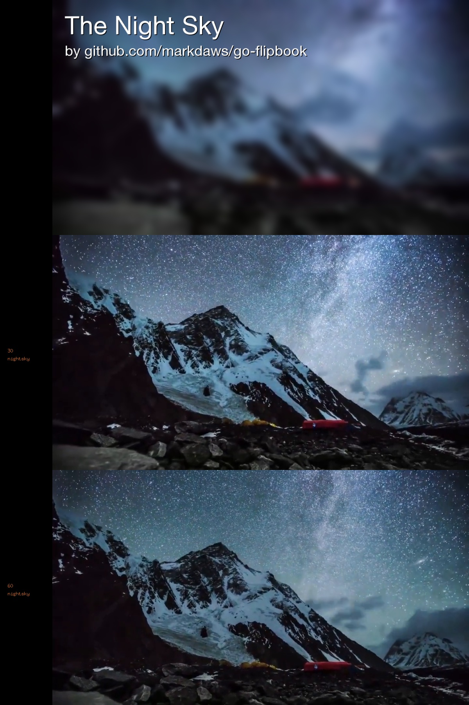

# go-flipbook
go based project that converts video to flipbook printable images - make your own flipbook

##Overview
This project takes input videos and renders frames from the video to images that can be used to make flip books. For example, given this input video: [night sky](test/sky.mp4) in the example we extract frames at 15fps, then composite the frames into a final set of images suitable for printing on a 6x4 piece of photo paper. Examples are:



The frames are rendered so that stacking the final sheets of paper only requires two cuts to assemble all of the frames into one final book. Simply stack all the composite images from first to last, then make two cuts and stack the smaller stacks, you end up with a flip book.

##Example usage
IMPORTANT: You need to have ffmpeg installed before running this app.

The example was generated by running the following command:
```bash
git clone https://github.com/markdaws/go-flipbook.git
cd go-flipbook
go get ./...
go install ./cmd/fbconvert/... && fbconvert -bgcolor=black -clean -fps=15  -identifier=nightsky -maxlength=6 -input=test/sky.mp4 -verbose -output=./test/output -fontpath=./HelveticaNeue.ttf -line1text="The Night Sky" -line2text="by github.com/markdaws/go-flipbook"
```

##Options

```
Usage of fbconvert:
  -bgcolor string
    	The background color of the image (for border). Can be white|black (default "white")
  -clean
    	If true, all files in the output directory are deleted before generating new items
  -cleanframes
    	If true, deletes all of the individual video frames after compositing
  -fontpath string
    	Path to the font file used for the text on the front cover (HeleveticNeue.ttf is included in the github repo)
  -fps int
    	The number of frames to generate per second of video. Min 10, max 60 (default 15)
  -identifier string
    	A string that will be printed on each frame, for easy identification
  -input string
    	Path to the input video source (required)
  -line1text string
    	Text to display on line 1 of the flipbook cover
  -line2text string
    	Text to display on line 2 of the flipbook cover
  -maxlength int
    	The maximum length of the input video to process in seconds (default 5)
  -output string
    	Path where the images will be written to. Images will be generated with names img001.png, img002.png ... etc. (required)
  -reverseframes
    	If true, frame 0 will be printed last, in this case you flip from the end of the book to the front to view the scene, which I have found is easier than flipping front to back
  -reversepages
    	If true, the lowest numbered output page will contain the last frames. Useful if you print and don't want to have to manually reverse the printed stack for assembly, so you end up with page 1 on top
  -skipcover
    	If true, a cover page is not added to the rendered frames
  -skipvideo
    	If true frames are not extracted and the input option is not required
  -verbose
    	Prints verbose output as the process is running
  -version
    	Displays the app version number
 ```
